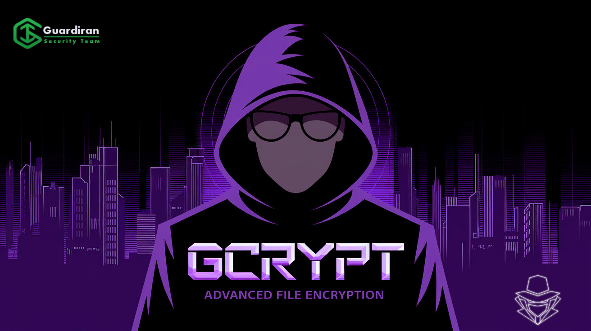
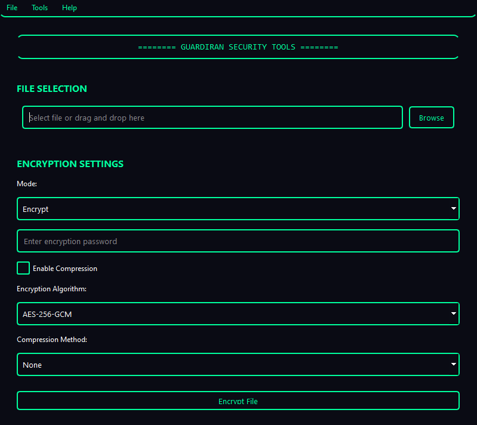

<div align="center">
  
  <h1>GCrypt</h1>
  <p>Advanced File Encryption Suite with Modern Cyberpunk Interface</p>
  <p><em>Beta Version 1.0</em></p>

  [](https://www.python.org/downloads/)
  [](LICENSE)
  [](https://www.riverbankcomputing.com/software/pyqt/)
  [](https://cryptography.io/)
  [](https://guardiran.org)
  [](https://t.me/d3f417ir)
</div>

---

## 🔒 Technical Specifications

### Encryption Algorithms

#### AES-256-GCM (Primary Recommendation)
- Key Size: 256 bits
- Block Size: 128 bits
- Mode: Galois/Counter Mode (GCM)
- Authentication: Built-in AEAD
- IV Size: 96 bits (12 bytes)
- Tag Size: 128 bits (16 bytes)
- Performance: ~3.5 GB/s on modern CPUs

#### ChaCha20-Poly1305
- Key Size: 256 bits
- Nonce: 96 bits
- MAC: Poly1305 (128 bits)
- Performance: ~1.5 GB/s on ARM devices
- Ideal for mobile/low-power devices

#### AES Variants
- **CBC Mode**:
  - IV Size: 128 bits
  - Padding: PKCS7
  - Block Operation: Chained
- **CFB Mode**:
  - Stream-like operation
  - No padding required
  - Real-time encryption
- **OFB Mode**:
  - Pre-generated keystream
  - Error non-propagation
  - Synchronous operation

#### Camellia-256
- Key Size: 256 bits
- Block Size: 128 bits
- Rounds: 24
- Security Level: Equivalent to AES-256

### Compression Methods

#### ZLIB
- Algorithm: DEFLATE
- Dictionary Size: 32 KB
- Compression Levels: 1-9
- Level 1: ~150 MB/s, ratio 2:1
- Level 6: ~70 MB/s, ratio 3:1
- Level 9: ~3 MB/s, ratio 4:1

#### LZMA
- Dictionary Size: Up to 4 GB
- Compression Levels: 1-9
- Level 1: ~80 MB/s, ratio 3:1
- Level 6: ~20 MB/s, ratio 4:1
- Level 9: ~1 MB/s, ratio 5:1

#### BZ2
- Block Size: 900 KB
- Compression Levels: 1-9
- Level 1: ~60 MB/s, ratio 2:1
- Level 9: ~10 MB/s, ratio 3:1

### Security Implementation

#### Key Derivation
- Algorithm: PBKDF2-HMAC-SHA256
- Iterations: 600,000
- Salt Size: 16 bytes
- Output Key Size: 32 bytes

#### Secure Deletion
- DoD 5220.22-M Standard
- Passes: 3 minimum, 7 maximum
- Verification: Post-deletion check
- Random Data Source: /dev/urandom

#### Memory Security
- Secure memory wiping
- Key material zeroing
- Protected memory pages
- Stack cleanup

#### Performance Metrics
- File Encryption: ~300 MB/s
- Batch Processing: ~200 MB/s
- Hash Calculation: ~500 MB/s
- Compression: Varies by method
- Memory Usage: ~100-500 MB

## 🚀 Features

### 🔒 Encryption Algorithms
- **AES-256-GCM** (recommended)
  - Military-grade encryption
  - Authenticated encryption with associated data (AEAD)
  - Perfect for sensitive data
- **AES-256-CBC**
  - Traditional block cipher mode
  - Widely supported
- **AES-256-CFB**
  - Stream cipher-like functionality
  - Real-time encryption capability
- **AES-256-OFB**
  - Output Feedback mode
  - Resistant to transmission errors
- **ChaCha20-Poly1305**
  - Modern stream cipher
  - High performance on all platforms
- **Camellia-256**
  - Alternative to AES
  - ISO/IEC certified

### 📦 File Compression
- **ZLIB**: Fast compression with good ratio
- **LZMA**: High compression ratio
- **BZ2**: Alternative compression algorithm
- Adjustable compression levels (1-9)

### 🔑 Password Generator
- Customizable length (8-64 characters)
- Multiple character sets
- Cryptographically secure
- One-click copy functionality

### 🔍 Hash Checker
- Multiple algorithms:
  - MD5 (not recommended for security)
  - SHA-1
  - SHA-256
  - SHA-512
- File integrity verification
- Hash comparison tool

### 📊 File Analyzer
- Detailed metadata analysis
- Multiple hash calculations
- Compression ratio analysis
- File type detection
- Size and timestamp information

### 🔄 Batch Processing
- Multiple file encryption/decryption
- Progress tracking
- Error handling and recovery
- Consistent settings across files

### 👀 File Monitoring
- Real-time directory monitoring
- Automatic encryption
- Event logging with timestamps
- Customizable monitoring rules

### 🗑️ Secure File Deletion
- DoD 5220.22-M compliant
- Multiple overwrite passes
- Verification after deletion
- Batch deletion support

## 💻 Installation

### Prerequisites
- Python 3.8 or higher
- 4GB RAM minimum (8GB recommended)
- Operating Systems:
  - Windows 10/11
  - Linux (most distributions)
  - macOS 10.15 or higher

### Step-by-Step Installation

1. **Clone the repository**
```bash
git clone https://github.com/Sir-D3F417/GCrypt.git
cd GCrypt
```

2. **Create virtual environment**
```bash
# Windows
python -m venv venv
venv\Scripts\activate

# Linux/macOS
python3 -m venv venv
source venv/bin/activate
```

3. **Install requirements**
```bash
pip install -r requirements.txt
```

4. **Run the application**
```bash
python GCrypt.py
```

## 🎯 Quick Start Guide

### File Encryption
1. Launch CryptoVault
2. Click "Select File" or drag & drop
3. Enter a strong password
4. Choose encryption algorithm (AES-256-GCM recommended)
5. Enable compression if desired
6. Click "Encrypt"

### File Decryption
1. Select encrypted file
2. Enter the correct password
3. Click "Decrypt"
4. Choose output location

### Batch Processing
1. Select multiple files
2. Configure settings once
3. Process all files simultaneously

## 🛡️ Security Features

- **Strong Encryption**
  - Industry-standard algorithms
  - Secure key derivation (PBKDF2)
  - Random IV generation

- **Data Protection**
  - Secure memory handling
  - Automatic backup creation
  - File integrity verification

- **Best Practices**
  - Strong password enforcement
  - Secure deletion options
  - Error recovery mechanisms

## 🎨 User Interface

<div align="center">
  
  <p><em>Modern Cyberpunk Interface</em></p>
  
<div align="center">
  <a href="https://www.youtube.com/watch?v=YOUR_VIDEO_ID">
    
  </a>
  <p><em>Click to watch the full demonstration on YouTube</em></p>
</div>

## 📝 License

This project is licensed under the MIT License - see the [LICENSE](LICENSE) file for details.

## 🙏 Acknowledgments

- GuardIran Security Team for development and maintenance
- PyQt6 Team for the GUI framework
- Cryptography.io Team for encryption libraries
- Open source community for various contributions

## 📞 Contact & Support

- **Website**: [guardiran.org](https://guardiran.org)
- **GitHub**: [@d3f417](https://github.com/Sir-D3F417)
- **Email**: info@d3f417.info
- **Bug Reports**: [Issue Tracker](https://github.com/Sir-D3F417/GCrypt/issues)

## 🌟 Star History

[](https://star-history.com/#Sir-D3F417/GCrypt&Date)
---

<div align="center">
  <p>Made with 💜 by GuardIran Security Team</p>
  <p>© 2025 GuardIran. All rights reserved.</p>
</div>
